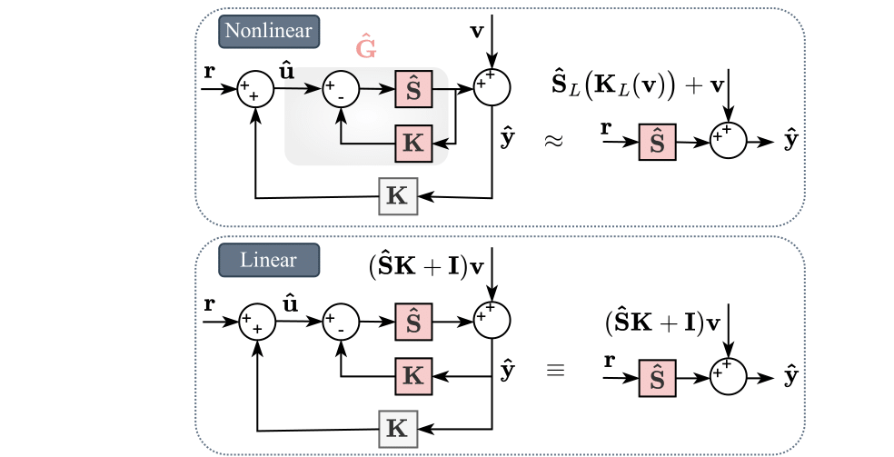

---

##### Download

+ [Paper](sysid.pdf)

---

##### Abstract

Neural networks have demonstrated remarkable success in modeling nonlinear dynamical systems. However, identifying these systems from closed-loop experimental data remains a challenge due to the correlations induced by the feedback loop. Traditional nonlinear closed-loop system identification methods struggle with reliance on precise noise models, robustness to data variations, or computational feasibility. Additionally, it is essential to ensure that the identified model is stabilized by the same controller used during data collection, ensuring alignment with the true system's closed-loop behavior. The dual Youla parameterization provides a promising solution for linear systems, offering statistical guarantees and closed-loop stability. However, extending this approach to nonlinear systems presents additional complexities. In this work, we propose a computationally tractable framework for identifying complex, potentially unstable systems while ensuring closed-loop stability using a complete parameterization of systems stabilized by a given controller. We establish asymptotic consistency in the linear case and validate our method through numerical comparisons, demonstrating superior accuracy over direct identification baselines and compatibility with the true system in stability properties.

---

##### Image: Simulations



---

##### Citation

Boroujeni, M. G., Meroi, L., Massai, L., Galimberti, C. L., & Ferrari-Trecate, G. (2025). Neural Identification of Feedback-Stabilized Nonlinear Systems. arXiv preprint arXiv:2503.22601.

```BibTeX
@misc{boroujeni2025neuralidentificationfeedbackstabilizednonlinear,
      title={Neural Identification of Feedback-Stabilized Nonlinear Systems}, 
      author={Mahrokh G. Boroujeni and Laura Meroi and Leonardo Massai and Clara L. Galimberti and Giancarlo Ferrari-Trecate},
      year={2025},
      eprint={2503.22601},
      archivePrefix={arXiv},
      primaryClass={eess.SY},
      url={https://arxiv.org/abs/2503.22601}, 
}
```

---

